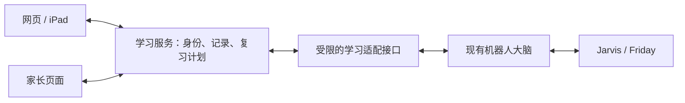

# 宝贝学习乐园

专为 6 岁小朋友设计的趣味学习应用，集娱乐与教育于一体。

## 功能特点

### 探索视频
- 精选儿童教育视频，嵌入式播放
- 视频结束自动遮罩，防止点击推荐
- 无需跳转，安全可控

### 数学游戏
- 10 以内加减法练习
- 随机出题，越答越有趣
- 连续答对有额外奖励

### 英语学习
- 26 个常用单词配图
- 点击发音，跟读学习
- 中文释义选择题

### 中文学习
- 20 个基础汉字认读
- 拼音标注
- 选择正确意思

### 奖励系统
- 答对得积分
- 连续答对奖励翻倍
- 星星飘落动画效果
- 进度自动保存

## 技术特点

- **PWA 支持**：可安装到手机桌面，像 App 一样使用
- **离线缓存**：Service Worker 支持离线访问
- **纯静态**：无需后端，GitHub Pages 直接部署
- **响应式设计**：适配手机和平板

## 网页与 Vector 机器人联动方案（待实现）

当前网页部署在 GitHub Pages（[app.tao.irish](https://app.tao.irish/)），学习记录保存在设备浏览器中。
本轮基础修复完善了本机保存和备份，但尚未增加账号、跨设备同步或机器人联动。

建议在家庭 Orin 上新增独立的轻量学习服务（FastAPI + SQLite），与机器人现有大脑服务并列运行。
不在 Orin 上加载本地大模型；需要生成题目或评估开放回答时，由服务端调用模型 API。
所有端共享孩子档案、知识点和答题记录，机器人控制仍由原服务负责。



### 复用范围

| 来源 | 可以复用 | 接入前需补齐 |
| --- | --- | --- |
| 本项目 | 交互题、绘本、书写、游戏界面与已有本机记录 | 稳定题目 ID、知识点映射、离线事件队列 |
| Vector 家教模块 | Marble 知识点、前置关系、选题/回溯思路、中文口语陪练 | 孩子 ID、答题事件 ID、可复习的掌握度、鉴权接口 |
| edu-app | 苏格拉底式提示、部分对话内容、学习路径展示思路 | 筛选适龄内容、真实记录；不能将客户端提供的 X-User-Id 当作登录身份 |

[Marble](https://github.com/withmarbleapp/os-taxonomy) 是知识点分类与依赖图，并不是可以直接给孩子做的完整题库。
复用时保留来源、版本及 ODbL / CC BY-SA 许可材料。题目应标注适用年龄、语言、呈现方式
（口头/屏幕/画图/实物）及审核状态；英文口语作答不能交给当前只识别中文的机器人 STT 判断。

### 第一版闭环

1. 家长账号管理孩子档案，孩子无需独立邮箱。服务端根据登录身份校验家庭与孩子的访问权限。
2. 统一保存答题事件：event_id、child_id、source、topic_id、taxonomy_version、question_id、题目版本、结果及时间。区分 correct / wrong / unclear / skipped；不将杂音算错题。
3. 浏览器先将事件写入 IndexedDB 队列，联网后同步。服务端按 event_id 去重，并返回同步游标；重复上传不能重复加分。旧的累计分数只能作为历史汇总迁移，不能反推每题掌握度。
4. 网页和机器人读取同一份复习计划；家长能看到“在哪个端练了什么、哪里需复习”。掌握度保留证据及下次复习时间，不能永久免测。
5. 先验证网页答题 → 机器人复习 → 家长查看记录这一条链路，再逐模块扩展。

现有机器人数据库按单个孩子设计，不能直接让多个网页设备写入它。
适配器应明确历史记录归属、使用稳定日志 ID，并以事务保存导入游标与学习事件；避免重复同步或漏记录。
机器人说话/动作只接受明确授权的学习指令，并继续遵守现有勿扰、互斥和停止机制。

### 部署选择与验收

- 家庭设备可以使用 Tailscale：优先把私人学习入口和 API 放在同一个 HTTPS 地址下，由 [Tailscale Serve](https://tailscale.com/docs/reference/tailscale-cli/serve) 提供私网访问。更换域名后浏览器存储不共享，需要从原站导出并明确导入。原 GitHub Pages 可继续提供离线功能入口。
- 如果需要任何浏览器直接访问：采用有正式鉴权的公网学习服务或网关；机器人通过受限连接交换学习数据。不能直接公开现有机器人大脑的全部接口。
- 即使在私网，也要区分家长权限和孩子档案；Tailscale 连接本身不等于应用内账号系统。
- Orin 需要异机备份及恢复验证。断电时网页仍可本机练习，联网后补传；第一版不引入数据库集群、向量库或本地推理服务。

验收至少覆盖：跨设备同一孩子、不同孩子隔离、断网后补传、重复上传、机器人与网页同时答题、杂音不扣分、备份恢复，以及接口无法绕过勿扰去控制机器人。
网络入口尚待选择；这些联动功能目前尚未部署。

## 本地运行

```bash
# 方式一：使用 npx serve
npx serve .

# 方式二：使用 Python
python3 -m http.server 8000
```

核心存档、备份恢复、题目边界回归测试（使用 Node 内置测试工具）：

```bash
node --test tests/*.test.cjs
```

## 自定义视频

编辑 `index.html` 中的视频列表，替换 YouTube 视频 ID：

```html
<div class="video-card" onclick="playVideo('名称', 'YouTube视频ID')">
  <div class="video-thumb">emoji</div>
  <p>视频标题</p>
</div>
```

## 添加更多题目

- 英语单词：编辑 `js/app.js` 中的 `englishWords` 数组
- 中文汉字：编辑 `js/app.js` 中的 `chineseChars` 数组

## 项目结构

```
kids-learning-app/
├── index.html          # 主页面
├── manifest.json       # PWA 配置
├── sw.js              # Service Worker
├── css/
│   └── style.css      # 样式和动画
├── js/
│   ├── app.js         # 主应用逻辑
│   └── rewards.js     # 奖励系统
└── icons/
    └── icon-192.svg   # 应用图标
```

## 许可

仅供个人学习使用
