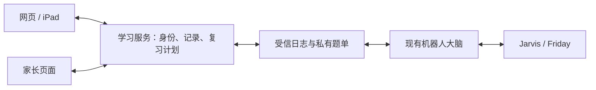

# 宝贝学习乐园

专为 6 岁小朋友设计的趣味学习应用，集娱乐与教育于一体。

## 功能特点

### 探索视频
- 精选儿童教育视频，嵌入式播放
- 视频结束自动遮罩，防止点击推荐
- 无需跳转，安全可控

### 数学游戏
- 10/20/30 范围及可配置的加减乘除练习
- 随机出题，越答越有趣
- 连续答对有额外奖励

### 英语学习
- 26 个常用单词配图
- 点击发音，跟读学习
- 中文释义选择题

### 中文学习
- 20 个基础汉字认读
- 拼音标注
- 选择正确意思

### 奖励系统
- 答对得积分
- 连续答对奖励翻倍
- 星星飘落动画效果
- 进度自动保存

## 技术特点

- **PWA 支持**：可安装到手机桌面，像 App 一样使用
- **离线缓存**：Service Worker 支持离线访问
- **游客模式纯静态**：GitHub Pages 直接部署；账号同步使用独立 Orin 服务
- **响应式设计**：适配手机和平板

## 账号与 Vector 机器人联动

当前网页部署在 GitHub Pages（[app.tao.irish](https://app.tao.irish/)），游客学习记录保存在设备浏览器中。
已加入独立账号服务、完整学习存档分区与自动同步、逐题日志和机器人数据桥。公网入口尚未配置，网页目前默认使用本机模式。
已实现数学、英语、中文、科学的新答题日志自动同步与断网补传；接通公网入口后才会在实际网页启用。机器人日志导入和基础加减法共享复习已部署，仍待 Iris 的实际口语验收。

账号仅在用户明确要求后由管理员通过服务器命令开通，首个账号为 `iris`（Iris）。不提供公开注册入口或 HTTP 注册接口。
未登录时保留原有纯网页功能。分数、错题、已保存作品和逐题日志均按游客/账号隔离；登录不会自动迁入游客记录。
技术及运维说明见 [backend/README.md](backend/README.md)，后续优先级见 [FEATURE_ROADMAP.md](FEATURE_ROADMAP.md)。

学习服务采用 FastAPI + SQLite，在家庭 Orin 上与机器人现有大脑服务分开部署。
不在 Orin 上加载本地大模型；需要生成题目或评估开放回答时，由服务端调用模型 API。
当前共享 Iris 的答题记录与最多两道基础加减法复习题；网页题尚未映射 Marble 掌握度，机器人控制继续由原服务负责。



### 复用范围

| 来源 | 可以复用 | 接入前需补齐 |
| --- | --- | --- |
| 本项目 | 交互题、绘本、书写、游戏界面、四个学科的逐题日志与离线队列 | 知识点及题目版本映射、其他模块逐题记录 |
| Vector 家教模块 | Marble 知识点、前置关系、选题/回溯思路、中文口语陪练 | 孩子 ID、答题事件 ID、可复习的掌握度、鉴权接口 |
| edu-app | 苏格拉底式提示、部分对话内容、学习路径展示思路 | 筛选适龄内容、真实记录；不能将客户端提供的 X-User-Id 当作登录身份 |

[Marble](https://github.com/withmarbleapp/os-taxonomy) 是知识点分类与依赖图，并不是可以直接给孩子做的完整题库。
复用时保留来源、版本及 ODbL / CC BY-SA 许可材料。题目应标注适用年龄、语言、呈现方式
（口头/屏幕/画图/实物）及审核状态；英文口语作答不能交给当前只识别中文的机器人 STT 判断。

### 下一阶段的教学闭环（待实现）

1. 先用管理员开通的 Iris 专属账号，无需独立邮箱。服务端根据会话确认身份，不接受客户端指定账号 ID。以后有明确需求再增加家长角色和多个孩子档案。
2. 统一保存答题事件：event_id、child_id、source、topic_id、taxonomy_version、question_id、题目版本、结果及时间。区分 correct / wrong / unclear / skipped；不将杂音算错题。
3. 已实现四个主要学科的 IndexedDB 事件队列、服务端去重和分页拉取；继续扩展其他模块、知识点和提示使用情况。旧的累计分数只能作为历史汇总迁移，不能反推每题掌握度。
4. 网页和机器人读取同一份复习计划；家长能看到“在哪个端练了什么、哪里需复习”。掌握度保留证据及下次复习时间，不能永久免测。
5. 先验证网页答题 → 机器人复习 → 家长查看记录这一条链路，再逐模块扩展。

现有机器人数据库按单个孩子设计，不能直接让多个网页设备写入它。
适配器应明确历史记录归属、使用稳定日志 ID，并以事务保存导入游标与学习事件；避免重复同步或漏记录。
机器人说话/动作只接受明确授权的学习指令，并继续遵守现有勿扰、互斥和停止机制。

### 已确定的部署方向与验收

- 使用公网 HTTPS 入口，按账号鉴权，不要求手机/iPad 安装 Tailscale。Tailscale 仅可作为既有 SSH 运维通道。
- 网页继续使用 GitHub Pages；学习 API 使用同站子域名或同源代理，机器人通过受限连接交换学习数据。不能直接公开现有机器人大脑的全部接口。
- API 尚未接入实际公网域名。`js/accountConfig.js` 的 `apiBase` 留空，因此当前不会发起后端请求，也不会阻止游客使用。
- Orin 学习服务已启动在 `127.0.0.1:8091`，配置用户级自启、5 分钟进程兜底和每日私有备份（14 份）；已复制一份到 Mac 并验证恢复登录。每日异机自动备份尚未配置。断电时网页仍可本机练习，已保存的账号队列联网后补传。

验收至少覆盖：跨设备同一孩子、不同孩子隔离、断网后补传、重复上传、机器人与网页同时答题、杂音不扣分、备份恢复，以及接口无法绕过勿扰去控制机器人。
网络方案已确定为公网账号访问，具体 HTTPS 入口尚待配置；机器人数据桥与基础加减法共享复习已部署；仍需 Iris 真正完成一场口语练习验收。

## 2026-10-02 功能可靠性优化

报告按真实日期统计；绘本支持续读和显式完成；跟读改为诚实的文字匹配反馈；SOS 与作品保存按实际结果提示，音乐作品可恢复。旧记录保留，不推断未记录的历史或掌握度。详细验证见 [优化记录](docs/优化记录-2026-10.md)。

## 本地运行

```bash
# 方式一：使用 npx serve
npx serve .

# 方式二：使用 Python
python3 -m http.server 8000
```

核心存档、备份恢复、题目边界回归测试（使用 Node 内置测试工具）：

```bash
node --test tests/*.test.cjs
```

## 自定义视频

频道及单视频白名单配置在 `js/videoWhitelistConfig.js`；`scripts/fetch_videos.py` 和每日 CI 生成 `data/videos.json`。旧 HTML 视频卡不是当前播放列表的数据源。以下仅是旧卡片格式示例：

```html
<div class="video-card" onclick="playVideo('名称', 'YouTube视频ID')">
  <div class="video-thumb">emoji</div>
  <p>视频标题</p>
</div>
```

## 添加更多题目

- 英语单词：编辑 `js/app.js` 中的 `englishWords` 数组
- 中文汉字：编辑 `js/app.js` 中的 `chineseChars` 数组

## 项目结构

```
kids-learning-app/
├── index.html          # 主页面
├── manifest.json       # PWA 配置
├── sw.js              # Service Worker
├── css/
│   └── style.css      # 样式和动画
├── js/
│   ├── app.js         # 主应用逻辑
│   └── rewards.js     # 奖励系统
└── icons/
    └── icon-192.svg   # 应用图标
```

## 许可

仅供个人学习使用
