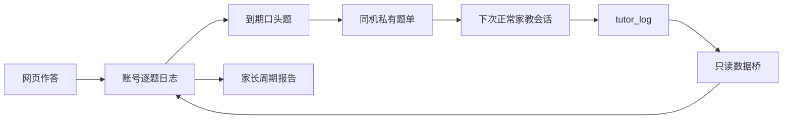

# 短课、复习与机器人数据契约

本说明对应 2026-10-v1 课程与 v81 前端。游客和账号共用课程；账号只改变存档归属和同步方式。公网账号入口仍需完成 DNS/HTTPS 配置，`apiBase` 尚为空。

## 一次学习怎样走完

首页“今天学一点”开始短课，默认每天 4 道数学/科学题、每轮 5 分钟。个人信息页可调每天 2/4/6 道和每轮 3/5/10 分钟；到时做完当前题再休息。先选到期复习，再选新题。同一题当天已经尝试过（含跳过或听不清），不反复追问；停止不会为未作答题造记录。这是短课上限，其他小游戏和原 Marble 家教仍有自己的预算。

点击提示不生成假作答；提交答案时记录 `hint_used:true`。答错后给出短解释，孩子可继续或休息。保存失败保留答案、事件 ID 和作答时间，重试不重复计数；成功以 IndexedDB 事务提交为准。目录下载和读取正文受 10 秒超时保护，失败可以重试，其他小游戏和账号功能继续使用。

绘本展示所有页并显式确认读完后，才提供可选的两道理解题。理解题不占数学/科学短课预算；查看原故事也算用过提示。每次读完会话的理解事件 ID 由 `completionId + questionId + questionVersion` 派生，刷新后过滤已保存题；下一次重读生成新会话，可以再练。读完自报与理解作答是两种独立证据。

## 课程数据

`data/curriculum.json` 含 26 个 topic、52 道固定中文选择题：10 个数学知识点、10 个科学知识点，各 2 题；6 本现有绘本各 2 题。数学科学 ID/年龄范围已与 Orin 现用 Marble v1 核对。题干、选项、提示、讲解由本项目编写，没有经过儿童教学效果试验。

topic 字段：`id/subject/title/marble_id/age_min/age_max`。question 字段：`id/version/topic_id/subject/question/choices/expected/hint/explanation/modality/book_id`。每题三种不同选项且正确答案必须在选项中。口头题只需听题与短回答；阅读理解为 screen，不送机器人。

许可与署名见 [题库说明](../data/CURRICULUM-LICENSE.md)。数据库映射 ODbL 1.0，课程文字 CC BY-SA 4.0。版本改变时旧记录保留，但不冒充新版课程证据；更改题干、答案或选项必须增加题目版本。

## 日志与复习

旧网页九字段与旧机器人日志仍兼容，不需数据库迁移。新网页 v2 精确为 14 字段：

```json
{
  "id": "事件唯一ID", "occurred_at": "UTC毫秒时间", "source": "web",
  "subject": "math", "question_id": "lesson:add-combine:1",
  "question": "固定题干", "expected": "5", "answer": "5", "verdict": "correct",
  "schema_version": 2, "topic_id": "mt_OvyoRo47K-", "taxonomy_version": "v1",
  "question_version": "1", "hint_used": false
}
```

阅读 `subject:reading`，`taxonomy_version:null`。公开上传只接受网页来源、已知题目及完全匹配的版本/题干/答案/知识点；所选答案与判定也必须一致。账号由会话决定，`expected_account_id` 仅用于阻止切号期间错投。重传同 ID 同内容幂等；不同内容整批拒绝，不能覆盖已有记录。

受信机器人 v2 多一个 `robot` 字段，提示未知为 `hint_used:null`；保留原始语音转写，不改成标准答案。只有同机私有适配器可导入，网页不能冒充此来源。机器人判断仍由既有 DeepSeek 口语判题产生，不等于语音识别质量经过验收。

`js/studyEngine.js` 与 `backend/study.py` 按实际作答时间排序、毫秒同刻按事件 ID 稳定排序。它们排除未来、冲突 ID、坏元数据和旧版本课程记录。首次不同日期无提示答对复测间隔 1 天，随后 3/7/14/30 天；同一天多次不会推进阶段。答错、提示后答对或机器人提示未知答对，次日复测。unclear/skipped 不改变复习阶段。阶段是排题规则，不是“掌握程度”；历史独立练习天数也不能证明全部技能已掌握。

纯引擎不读账号，调用者必须先按 owner 取日志。默认洛杉矶时区；前端课程/报告取本账号 `kidsProfileData.learningSettings`，后端新课程优先取同账号已同步快照的合法时区和每日题数，缺失时使用绑定默认。尚未同步的设置以服务器最近快照为准。旧基础加减法桥继续使用原绑定时区。

`GET /api/study/plan` 需登录，提供当前账号题单/证据/时区；断网游客直接用同源课程和本机引擎。设置加入已有资料键，31 个完整备份键、28 个账号键均不增加。逐题事件仍在 IndexedDB，独立导出，不在资料快照内。

## Jarvis / Friday



旧基础加减法最多两道继续支持。新课程仅取已有证据的到期 oral 数学/科学题，总共最多占原机器人会话两个名额；不增加其总题数，不公开硬件控制入口。机器人重新读取本机课程并检查课程版本/题目版本，忽略题单自带的任意题干与答案。读出三个选项，避免问“下面哪个”却没有展示选项。文件/版本/权限/时效不满足时退回原 Marble。

独立后端为 Orin 回环 8091；原机器人大脑仍是回环 8090。勿扰、夜间、活动互斥、停止以及杂音不判错的约束沿用机器人项目规则。数据桥 ready 表示数据处理成功，不能表示机器人在线或孩子真实做过题。

## 家长报告与备份

报告保留真实周/月统计，并展示未用提示答对、提示后答对、提示未知、错误及样本数。近期知识点证据只看当前周期，到期题从本账号全部历史计算；重复同题同日不会被说成多个技能掌握。目录不可用明确提示，保留原周期统计；分享使用当前显示周期，不含账号 ID。

Orin 每日一致性备份保留 14 份。`scripts/offsite_backup.py` 通过已有 SSH 从服务器 Backup API 拉取私有单文件副本，检查 SQLite 完整性、必要表与零会话，成功后才清理 Mac 旧副本。Mac 用户 LaunchAgent 每日 09:15 尝试，保留 30 份；电脑或连接不可用时当次失败，旧副本保留，不能保证关机时备份。配置、日志和副本位于 Git/静态目录之外。

恢复前先备份当前库，停止独立学习服务，在私有临时目录验证副本，再替换库并重新登录。不要覆盖运行中的 WAL 数据库，不要把副本上传 GitHub Pages。
