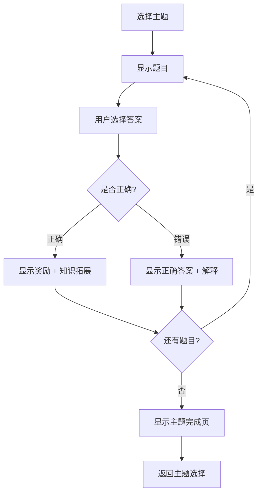

# 科学学科模块 - 产品需求文档

**编写**: 小雨 (产品经理)
**版本**: v1.0
**日期**: 2026-01-20
**状态**: 待评审

---

## 1. 功能概述

### 1.1 模块定位

「科学探索」模块旨在培养5-7岁儿童对自然世界的好奇心，通过趣味问答的方式学习基础科学知识。

### 1.2 设计理念

| 原则 | 说明 |
|------|------|
| 激发好奇 | 用有趣的问题引发思考 |
| 图文并茂 | 每题配有生动图片辅助理解 |
| 即时反馈 | 答对揭示更多有趣知识 |
| 循序渐进 | 从身边事物到自然现象 |

### 1.3 目标用户

- **核心用户**: 5-7岁儿童
- **使用场景**: 亲子互动、自主探索、碎片时间学习
- **学习目标**: 认识动物、了解自然、培养科学思维

---

## 2. 功能需求

### 2.1 页面入口

**位置**: 首页学习菜单，新增「科学探索 🔬」入口

**图标**: 🔬 或 🌍

**入口文案**: "科学探索 - 发现神奇的世界"

### 2.2 主界面设计

```
┌─────────────────────────────────┐
│  ← 返回        科学探索 🔬       │
├─────────────────────────────────┤
│                                 │
│    ┌─────────────────────┐      │
│    │                     │      │
│    │    [题目图片区域]    │      │
│    │     200x150px       │      │
│    │                     │      │
│    └─────────────────────┘      │
│                                 │
│    ┌─────────────────────┐      │
│    │  🦁 这是什么动物？    │      │
│    │                     │      │
│    │  这种动物被称为      │      │
│    │  "森林之王"          │      │
│    └─────────────────────┘      │
│                                 │
│  ┌─────────┐  ┌─────────┐      │
│  │  🐯 老虎 │  │  🦁 狮子 │      │
│  └─────────┘  └─────────┘      │
│  ┌─────────┐  ┌─────────┐      │
│  │  🐻 熊   │  │  🐺 狼   │      │
│  └─────────┘  └─────────┘      │
│                                 │
│         [ 第 3/10 题 ]          │
└─────────────────────────────────┘
```

### 2.3 题目分类

模块包含 **3个主题**，每个主题 **10道题目**：

| 主题 | 图标 | 知识点 | 题目数 |
|------|------|--------|--------|
| 动物世界 | 🦁 | 动物认知、分类、习性 | 10 |
| 神奇植物 | 🌻 | 植物认知、生长、用途 | 10 |
| 自然现象 | 🌈 | 天气、季节、自然规律 | 10 |

### 2.4 主题选择界面

```
┌─────────────────────────────────┐
│  ← 返回        科学探索 🔬       │
├─────────────────────────────────┤
│                                 │
│      选择你想探索的主题 🎯       │
│                                 │
│  ┌─────────────────────────┐    │
│  │  🦁 动物世界             │    │
│  │  认识各种神奇的动物      │    │
│  │  ████████░░ 8/10        │    │
│  └─────────────────────────┘    │
│                                 │
│  ┌─────────────────────────┐    │
│  │  🌻 神奇植物             │    │
│  │  探索植物的奥秘          │    │
│  │  ████░░░░░░ 4/10        │    │
│  └─────────────────────────┘    │
│                                 │
│  ┌─────────────────────────┐    │
│  │  🌈 自然现象             │    │
│  │  了解大自然的秘密        │    │
│  │  ░░░░░░░░░░ 0/10        │    │
│  └─────────────────────────┘    │
│                                 │
└─────────────────────────────────┘
```

### 2.5 答题流程



### 2.6 答对反馈设计

**奖励弹窗内容**:
```
┌─────────────────────────────────┐
│                                 │
│         ⭐ 答对啦！⭐            │
│                                 │
│         🦁 狮子                 │
│                                 │
│    ┌─────────────────────┐      │
│    │  💡 你知道吗？        │      │
│    │                     │      │
│    │  狮子是唯一群居的    │      │
│    │  猫科动物哦！        │      │
│    │  一个狮群通常有      │      │
│    │  10-15只狮子。       │      │
│    └─────────────────────┘      │
│                                 │
│         +15 积分 🎉             │
│                                 │
│      [ 继续探索 → ]             │
│                                 │
└─────────────────────────────────┘
```

### 2.7 答错反馈设计

```
┌─────────────────────────────────┐
│                                 │
│         😊 没关系！              │
│                                 │
│    正确答案是：🦁 狮子           │
│                                 │
│    ┌─────────────────────┐      │
│    │  📖 小知识            │      │
│    │                     │      │
│    │  狮子生活在非洲草原  │      │
│    │  它们有漂亮的鬃毛    │      │
│    └─────────────────────┘      │
│                                 │
│      [ 继续学习 → ]             │
│                                 │
└─────────────────────────────────┘
```

---

## 3. 数据结构

### 3.1 题目数据模型

```javascript
{
  id: "science_animal_001",       // 唯一标识
  theme: "animal",                // 主题: animal/plant/nature
  question: "这是什么动物？",      // 题目文本
  hint: "这种动物被称为"森林之王"", // 提示语
  image: "🦁",                    // 题目图片(Emoji)
  options: [                      // 选项列表
    { id: "A", text: "老虎", emoji: "🐯" },
    { id: "B", text: "狮子", emoji: "🦁" },
    { id: "C", text: "熊", emoji: "🐻" },
    { id: "D", text: "狼", emoji: "🐺" }
  ],
  answer: "B",                    // 正确答案
  explanation: "狮子是唯一群居的猫科动物...", // 知识拓展
  difficulty: 1                   // 难度: 1简单 2中等 3困难
}
```

### 3.2 学习进度数据

```javascript
// 存储在 kidsLearningData 中
{
  // ... 现有字段
  scienceProgress: {
    animal: {
      completed: [1, 2, 3],      // 已完成题目ID
      correct: 2,                 // 答对数量
      total: 3                    // 尝试数量
    },
    plant: { ... },
    nature: { ... }
  },
  scienceCorrect: 0              // 科学总答对数
}
```

---

## 4. 积分规则

| 行为 | 积分 | 说明 |
|------|------|------|
| 答对1题 | +15分 | 与英语/中文模块一致 |
| 完成1个主题 | +50分 | 额外奖励 |
| 全部主题完成 | +100分 | 成就奖励 |

---

## 5. 题目示例（动物世界主题）

### 题目1 - 简单
| 字段 | 内容 |
|------|------|
| 问题 | 这是什么动物？ |
| 提示 | 它是"森林之王" |
| 图片 | 🦁 |
| 选项 | 🐯老虎 / 🦁狮子 / 🐻熊 / 🐺狼 |
| 答案 | 狮子 |
| 拓展 | 狮子是唯一群居的猫科动物，一个狮群通常有10-15只 |

### 题目2 - 简单
| 字段 | 内容 |
|------|------|
| 问题 | 哪种动物会飞？ |
| 提示 | 它有翅膀和羽毛 |
| 图片 | 🐦 |
| 选项 | 🐟鱼 / 🐦鸟 / 🐍蛇 / 🐸青蛙 |
| 答案 | 鸟 |
| 拓展 | 鸟类是唯一有羽毛的动物，大多数鸟都会飞 |

### 题目3 - 简单
| 字段 | 内容 |
|------|------|
| 问题 | 哪种动物生活在水里？ |
| 提示 | 它用鳃呼吸 |
| 图片 | 🐟 |
| 选项 | 🐟鱼 / 🐕狗 / 🐈猫 / 🐔鸡 |
| 答案 | 鱼 |
| 拓展 | 鱼生活在水中，用鳃呼吸，用鳍游泳 |

### 题目4 - 中等
| 字段 | 内容 |
|------|------|
| 问题 | 熊猫最爱吃什么？ |
| 提示 | 这是一种绿色的植物 |
| 图片 | 🐼 |
| 选项 | 🍎苹果 / 🎋竹子 / 🥕胡萝卜 / 🍖肉 |
| 答案 | 竹子 |
| 拓展 | 大熊猫99%的食物都是竹子，每天要吃12-38公斤竹子 |

### 题目5 - 中等
| 字段 | 内容 |
|------|------|
| 问题 | 哪种动物是哺乳动物？ |
| 提示 | 它会给宝宝喂奶 |
| 图片 | 🐋 |
| 选项 | 🦈鲨鱼 / 🐋鲸鱼 / 🐠金鱼 / 🦑章鱼 |
| 答案 | 鲸鱼 |
| 拓展 | 虽然鲸鱼生活在水里，但它是哺乳动物，用肺呼吸，会给宝宝喂奶 |

---

## 6. 交互规范

### 6.1 动画效果

| 交互 | 动画 | 时长 |
|------|------|------|
| 选项点击 | 缩放 0.95 → 1 | 100ms |
| 答对 | 选项变绿 + 弹跳 | 300ms |
| 答错 | 选项变红 + 抖动 | 300ms |
| 弹窗出现 | 淡入 + 缩放 | 300ms |
| 进度条 | 平滑增长 | 500ms |

### 6.2 音效

| 场景 | 音效 |
|------|------|
| 答对 | correct 音效 |
| 答错 | wrong 音效 |
| 完成主题 | complete 音效 |

### 6.3 颜色规范

| 元素 | 颜色 |
|------|------|
| 主题色 | #4CAF50 (绿色/自然) |
| 答对 | #4CAF50 |
| 答错 | #FF5722 |
| 进度条 | 渐变绿色 |

---

## 7. 任务交接单

### 交给阿杰（前端开发）

```markdown
**来自**: 小雨
**交给**: 阿杰
**任务**: 实现科学探索模块前端界面
**输入**: 本需求文档
**期望输出**:
1. 主题选择页面
2. 答题界面
3. 答对/答错反馈弹窗
4. 进度保存功能
**优先级**: P0
```

### 交给小美（内容策划）

```markdown
**来自**: 小雨
**交给**: 小美
**任务**: 编写完整的科学题库（30题）
**输入**: 本需求文档中的数据结构和示例
**期望输出**:
1. 动物世界 10题
2. 神奇植物 10题
3. 自然现象 10题
4. JavaScript 数据文件
**优先级**: P0
```

### 交给大明（测试）

```markdown
**来自**: 小雨
**交给**: 大明
**任务**: 编写科学模块测试用例
**输入**: 本需求文档
**期望输出**:
1. 功能测试用例
2. 边界条件测试
3. 兼容性测试计划
**优先级**: P1（开发完成后执行）
```

---

## 8. 验收标准

- [ ] 能够选择三个主题进入答题
- [ ] 题目图片、文字、选项正确显示
- [ ] 答对显示奖励弹窗和知识拓展
- [ ] 答错显示正确答案和解释
- [ ] 积分正确累加
- [ ] 进度正确保存和显示
- [ ] 完成主题有额外奖励
- [ ] 动画流畅，音效正常

---

**文档状态**: ✅ 已完成，待团队评审

**下一步**:
1. @小美 开始编写题库
2. @阿杰 评审技术可行性
3. @大明 准备测试计划
